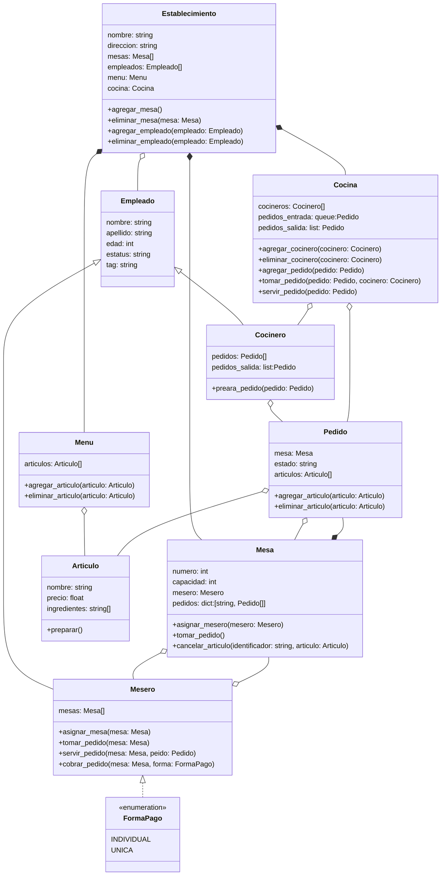

# UML

```mermaid
classDiagram
    class Establecimiento{
        nombre: string
        direccion: string
        mesas: Mesa[]
        empleados: Empleado[]
        menu: Menu
        cocina: Cocina
        +agregar_mesa()
        +eliminar_mesa(mesa: Mesa)
        +agregar_empleado(empleado: Empleado)
        +eliminar_empleado(empleado: Empleado)
    }

    class Cocina{
        cocineros: Cocinero[]
        pedidos_entrada: queue:Pedido
        pedidos_salida: list: Pedido
        +agregar_cocinero(cocinero: Cocinero)
        +eliminar_cocinero(cocinero: Cocinero)
        +agregar_pedido(pedido: Pedido)
        +tomar_pedido(pedido: Pedido, cocinero: Cocinero)
        +servir_pedido(pedido: Pedido)
    }

    class Empleado{
        nombre: string
        apellido: string
        edad: int
        estatus: string
        tag: string
    }

    class Cocinero{
        pedidos: Pedido[]
        pedidos_salida: list:Pedido
        +preara_pedido(pedido: Pedido)
    }

    class Pedido{
        mesa: Mesa
        estado: string
        articulos: Articulo[]
        +agregar_articulo(articulo: Articulo)
        +eliminar_articulo(articulo: Articulo)
    }

    class Menu{
        articulos: Articulo[]
        +agregar_articulo(articulo: Articulo)
        +eliminar_articulo(articulo: Articulo)
    }

    class Mesa{
        numero: int
        capacidad: int
        mesero: Mesero
        pedidos: dict:[string, Pedido[]]
        +asignar_mesero(mesero: Mesero)
        +tomar_pedido()
        +cancelar_articulo(identificador: string, articulo: Articulo)
    }


    class Articulo{
        nombre: string
        precio: float
        ingredientes: string[]
        +preparar()
    }

    class Mesero{
        mesas: Mesa[]
        +asignar_mesa(mesa: Mesa)
        +tomar_pedido(mesa: Mesa)
        +servir_pedido(mesa: Mesa, peido: Pedido)
        +cobrar_pedido(mesa: Mesa, forma: FormaPago)
    }

    class FormaPago{
        <<enumeration>>
        INDIVIDUAL
        UNICA
    }

    Establecimiento *--Menu
    Establecimiento *--Cocina
    Establecimiento o--Empleado
    Menu o--Articulo
    Pedido o--Articulo
    Mesa *--Pedido
    Establecimiento *--Mesa
    Empleado <|-- Mesero
    Pedido o--Mesa
    Empleado <|-- Cocinero
    Mesero <|.. FormaPago
    Cocina o-- Cocinero
    Mesa o-- Mesero
    Mesero o-- Mesa
    Cocinero o-- Pedido
    Cocina o-- Pedido
```
