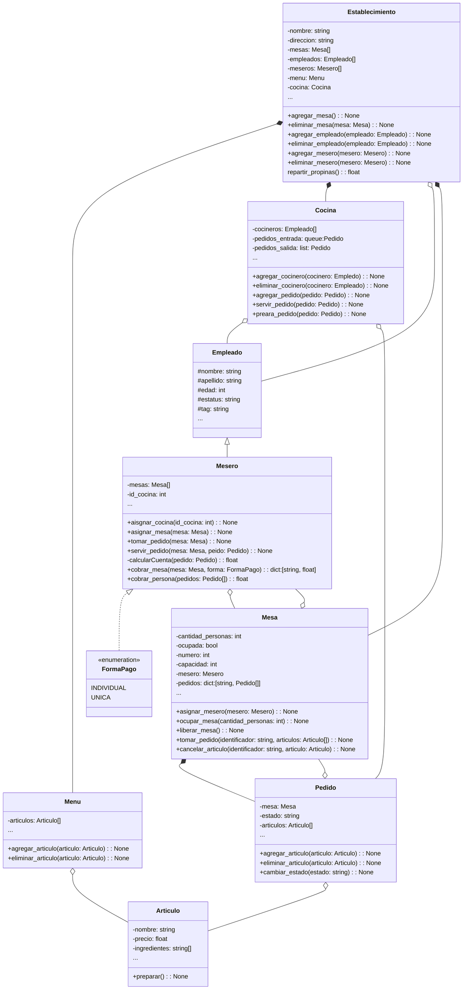

<!-- cspell: disable -->

# UML

```mermaid
classDiagram
    class Establecimiento{
        -nombre: string
        -direccion: string
        -mesas: Mesa[]
        -empleados: Empleado[]
        -meseros: Mesero[]
        -menu: Menu
        -cocina: Cocina
        +agregar_mesa(): None
        +eliminar_mesa(mesa: Mesa): None
        +agregar_empleado(empleado: Empleado) : None
        +eliminar_empleado(empleado: Empleado) : None
        +agregar_mesero(mesero: Mesero): None
        +eliminar_mesero(mesero: Mesero): None
        repartir_propinas(): float
        ...
    }

    class Cocina{
        -cocineros: Empleado[]
        -pedidos_entrada: queue:Pedido
        -pedidos_salida: list: Pedido
        +agregar_cocinero(cocinero: Empledo): None
        +eliminar_cocinero(cocinero: Empleado): None
        +agregar_pedido(pedido: Pedido): None
        +servir_pedido(pedido: Pedido): None
        +preara_pedido(pedido: Pedido): None
        ...
    }

    class Empleado{
        #nombre: string
        #apellido: string
        #edad: int
        #estatus: string
        #tag: string
        ...
    }

    class Mesero{
        -mesas: Mesa[]
        -id_cocina: int
        +aisgnar_cocina(id_cocina: int): None
        +asignar_mesa(mesa: Mesa): None
        +tomar_pedido(mesa: Mesa): None
        +servir_pedido(mesa: Mesa, peido: Pedido): None
        -calcularCuenta(pedido: Pedido): float
        +cobrar_mesa(mesa: Mesa, forma: FormaPago): dict:[string, float]
        +cobrar_persona(pedidos: Pedido[]): float
        ...
    }

    class FormaPago{
        <<enumeration>>
        INDIVIDUAL
        UNICA
    }

    class Mesa{
        -cantidad_personas: int
        -ocupada: bool
        -numero: int
        -capacidad: int
        -mesero: Mesero
        -pedidos: dict:[string, Pedido[]]
        +asignar_mesero(mesero: Mesero): None
        +ocupar_mesa(cantidad_personas: int): None
        +liberar_mesa(): None
        +tomar_pedido(identificador: string, articulos: Articulo[]): None
        +cancelar_articulo(identificador: string, articulo: Articulo): None
        ...
    }

    class Menu{
        -articulos: Articulo[]
        +agregar_articulo(articulo: Articulo): None
        +eliminar_articulo(articulo: Articulo): None
        ...
    }

    class Pedido{
        -mesa: Mesa
        -estado: string
        -articulos: Articulo[]
        +agregar_articulo(articulo: Articulo): None
        +eliminar_articulo(articulo: Articulo): None
        +cambiar_estado(estado: string): None
        ...
    }

    class Articulo{
        -nombre: string
        -precio: float
        -ingredientes: string[]
        +preparar(): None
        ...
    }

    Establecimiento *--Menu
    Establecimiento *--Cocina
    Establecimiento o--Empleado
    Menu o--Articulo
    Pedido o--Articulo
    Mesa *--Pedido
    Establecimiento *--Mesa
    Empleado <|-- Mesero
    Pedido o--Mesa
    Mesero <|.. FormaPago
    Cocina o-- Empleado
    Mesa o-- Mesero
    Mesero o-- Mesa
    Cocina o-- Pedido
```
