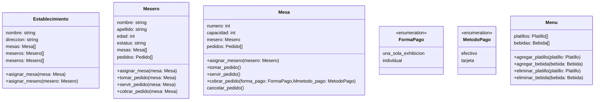

# UML

```mermaid
classDiagram
    class Establecimiento{
        nombre: string
        direccion: string
        mesas: Mesa[]
        meseros: Mesero[]
        +asignar_mesa(mesa: Mesa)
        +asignar_mesero(mesero: Mesero)
        meseros: Mesero[]


    }
    class Mesero{
        nombre: string
        apellido: string
        edad: int
        estatus: string
        mesas: Mesa[]
        pedidos: Pedido[]
        +asignar_mesa(mesa: Mesa)
        +tomar_pedido(mesa: Mesa)
        +servir_pedido(mesa: Mesa)
        +cobrar_pedido(mesa: Mesa)
    }

    class Mesa{
        numero: int
        capacidad: int
        mesero: Mesero
        pedidos: Pedido[]
        +asignar_mesero(mesero: Mesero)
        +tomar_pedido()
        +servir_pedido()
        +cobrar_pedido(forma_pago: FormaPago,Mmetodo_pago: MetodoPago)
        cancelar_pedido()
    }

    class FormaPago{
        <<enumeration>>
        una_sola_exhibicion
        individual

    }

    class MetodoPago{
        <<enumeration>>
        efectivo
        tarjeta
    }

    class Menu{
        platillos: Platillo[]
        bebidas: Bebida[]
        +agregar_platillo(platillo: Platillo)
        +agregar_bebida(bebida: Bebida)
        +eliminar_platillo(platillo: Platillo)
        +eliminar_bebida(bebida: Bebida)
    }
```
